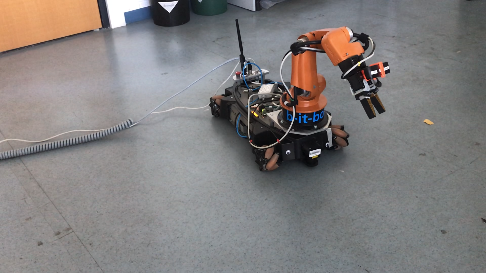

# Test report 07.07.2018

|                                      |                                       |
|--------------------------------------|---------------------------------------|
| Date & Time                          | 07.07.2018, 13:30-18:00               |
| Tester                               | Abhishek Padalkar                     |
| Software versions                    | ROS Indigo                            |
|                                      | OpenCV 3.1.0                          |
| Hardware configuration               | KUKA youbot 4                         |
|                                      | ASUS Xtion Pro Live                   |
| Tested feature                       | Acquisition and repetion of dynamic motion primitives that are partially outside of the robot's dexterous workspace |
| Test setup / environment             | C025 lab, HBRS, RoboCup@Work arena    |
|                                      | lab floor (ground level)              |

## Test procedure

___On the robot:___
1. Switch on the youbot
2. Launch the robot bringup: `roslaunch mir_bringup robot.launch`
3. Launch moveit: `roslaunch mir_moveit_youbot_brsu_4 move_group.launch`

___On an external machine:___
1. Export the `ROS_MASTER_URI`: `export ROS_MASTER_URI=http://youbot-brsu-4-pc1:11311`
2. Run the script *demonstrated_trajectory_recorder.py* in order to record a trajectory: `rosrun demonstrated_trajectory_recorder demonstrated_trajectory_recorder.py`
3. In the command prompt, press ENTER to start recording; this will open a window that shows the current view of the camera
4. Demonstrate a trajectory by moving the aruco marker board
5. When done demonstrating, press q in the window and write a trajectory name in the command prompt
6. Copy the recorded file to `ros_dmp/data/recorded_trajectories/23_05`
7. Run the script `ros_dmp/src/learn_motion_primitive.py` to learn the weights of the motion primitive; the weights will be saved to `ros_dmp/data/weights/weights_<trajectory_name>.yaml`.
8. For safety reasons, move the robot to open space before repeating any demonstrated trajectories.
9. To repeat a demonstrated trajectory, change the initial and goal position in `ros_dmp/src/test.py` and then run `test.py`. If multiple goal poses are specified, the robot will go to each one of those; however, each pose will first be repeated a given number of times. After finishing each trial, press ENTER to go to the next trial. The data for each trial (both the planned and executed trajectories) are saved to a specified location.

## Experimental setup

## Test assumptions

* There are no obstacles in the environment
* The camera used for recording the trajectory is calibrated
* The camera frame rate is low (~5fps), so the trajectory has to be demonstrated slowly
* The test environment is static
* Trajectories are recorded in the base link frame
* The joint encoders are working properly and their measurements are considered ground truth values (there is no external robot pose observer, so the encoder measurements are used for measuring the position of the manipulator)

## Test 1:

### Test objectives

* Acquiring a demonstrated trajectory (inverse parabolic curve) which is partially outside of the robot's dexterous workspace
* Repeating the demonstrated trajectory with five different goal locations. The different goal locations are specified as follows:
** goal 1: x same as demonstrated final position, y same, z + 15cm
** goal 2: x - 5cm, y same, z + 15cm 
** goal 3: x same, y + 10cm, z + 15cm
** goal 4: x + 5cm, y + 5cm, z + 15cm
** goal 5: x + 15cm, y + 15cm, z + 15cm

### Test parameters

* Number of basis functions: 50
* tau = 1
* Number of trials: 10
* A height offset of 15cm is introduced in the z coordinate as the motion is controlled with respect to arm_link_5 (at the mount point of the gripper), but the demonstration was with respect to the tip of the gripper

### Observations

* Since the demonstrated trajectory has initial and final z values that are practically equal to each other, varying z creates infeasible resulting trajectories; this primitive is thus limited to scenarios in which the initial and final z position are the same (e.g. moving an object from one side of a table to another)
 

## Test 2

### Test objectives

* Acquiring a demonstrated trajectory (rectangular shape) which is partially outside of the robot's dexterous workspace
* Repeating the demonstrated trajectory with five different goal locations. The different goal locations are specified as follows:
** goal 1: x same as demonstrated, y same, z + 15cm
** goal 2: x + 2cm, y same, z + 15cm 
** goal 3: x same, y + 10cm, z + 15cm
** goal 4: x + 5cm, y - 5cm, z + 15cm
** goal 5: x - 5cm, y + 15cm, z + 15cm

### Test parameters

* Number of basis functions: 150
* tau = 1
* Number of trials: 10
* An offset of 5cm was introduced to the x position because the initial position of the demonstrated trajectory was very close to the body of the robot
* A height offset of 15cm is introduced in the z coordinate as the motion is controlled with respect to arm_link_5 (at the mount point of the gripper), but the demonstration was with respect to the tip of the gripper

### Observations

* Since the demonstrated trajectory has initial and final z values that are practically equal to each other, varying z creates infeasible resulting trajectories; this primitive is thus limited to scenarios in which the initial and final z position are the same (e.g. moving an object from one side of a table to another)

## General observations

* Increasing tau too much (e.g. 100) causes overshoots at sharp turns.

